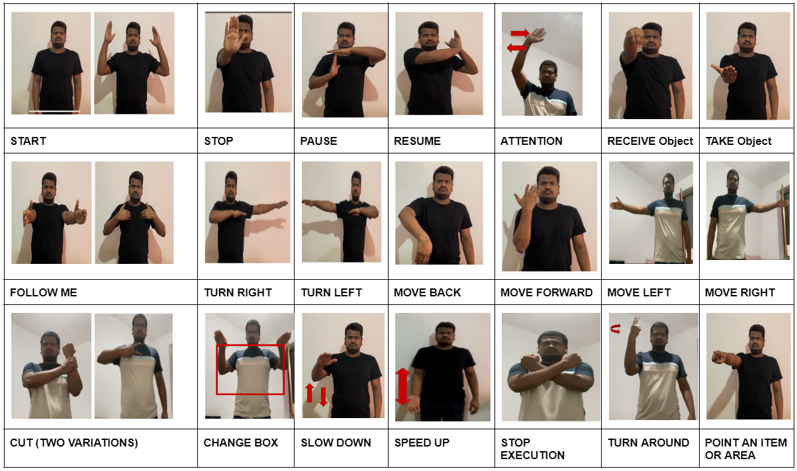
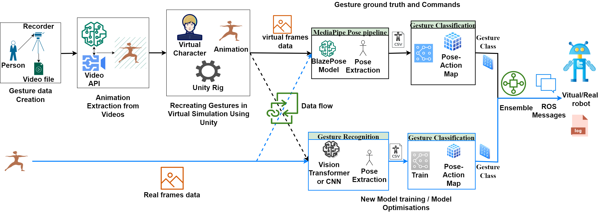

# GR_ICSR_23_info
Additional required info for the ICSR 23 paper
Within this repository, you will find the Confusion Matrices corresponding to the CNN classification present in our Simulation and realdata set, for gesture recognition

The 21 Defined Gestures for the ground robots are as follows  and a subset of gestures were taken for the experiment. These definitions were inspired from [Jia Chuan A. Tan, Wesley P. Chan, Nicole L. Robinson, Elizabeth A. Croft, and
Dana Kulic. 2021. A Proposed Set of Communicative Gestures for Human Robot Interaction and an RGB Image-based Gesture Recognizer Implemented in ROS.(2021).] (https://doi.org/10.48550/ARXIV.2109.09908)

The following image explains the pipeline. Added for reading purposes if the image on the paper is too pixelated in pdf.

The confusion matix on 20%Real data(RD) - 80% Virtual data(VD) follows as below

## To-Do
1. Add the train graphs and CM images of all combinations of data.
