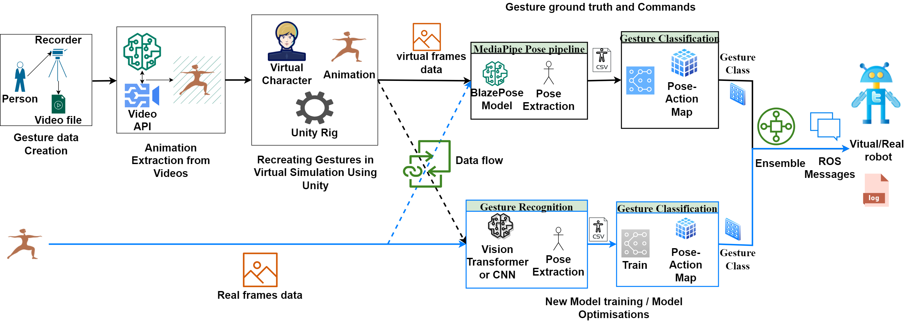
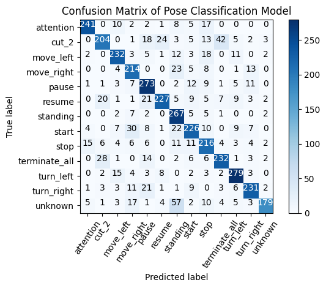

# GR_ICSR_23_info
Additional required info for the ICSR 23 paper
Within this repository, you will find the Confusion Matrices corresponding to the CNN classification present in our Simulation and realdata set, for gesture recognition

The following image explains the pipeline. Added for reading purposes if the image on th epaper is too pixelated in pdf.

The confusion matix on 20%Real data(RD) - 80% Virtual data(VD) follows as below

To-Do
1. Add the train graphs and CM images of all combinations of data.
